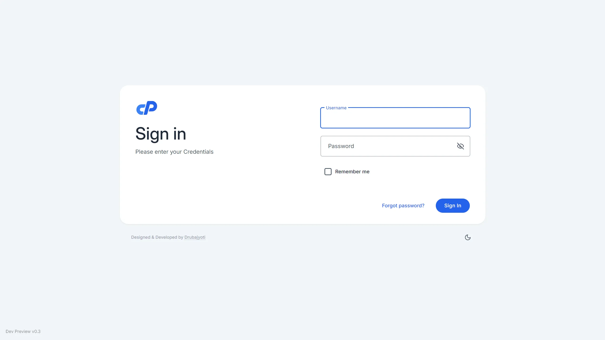
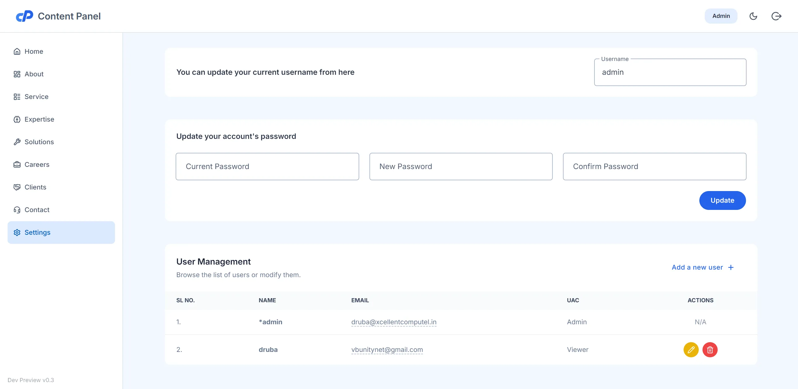
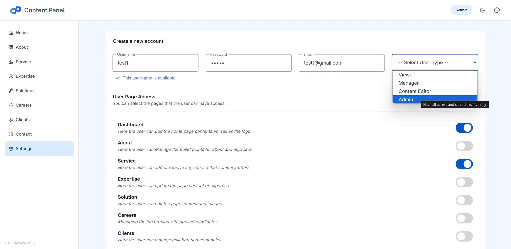
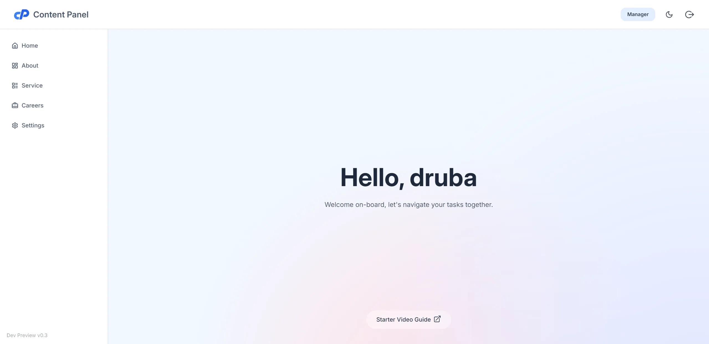
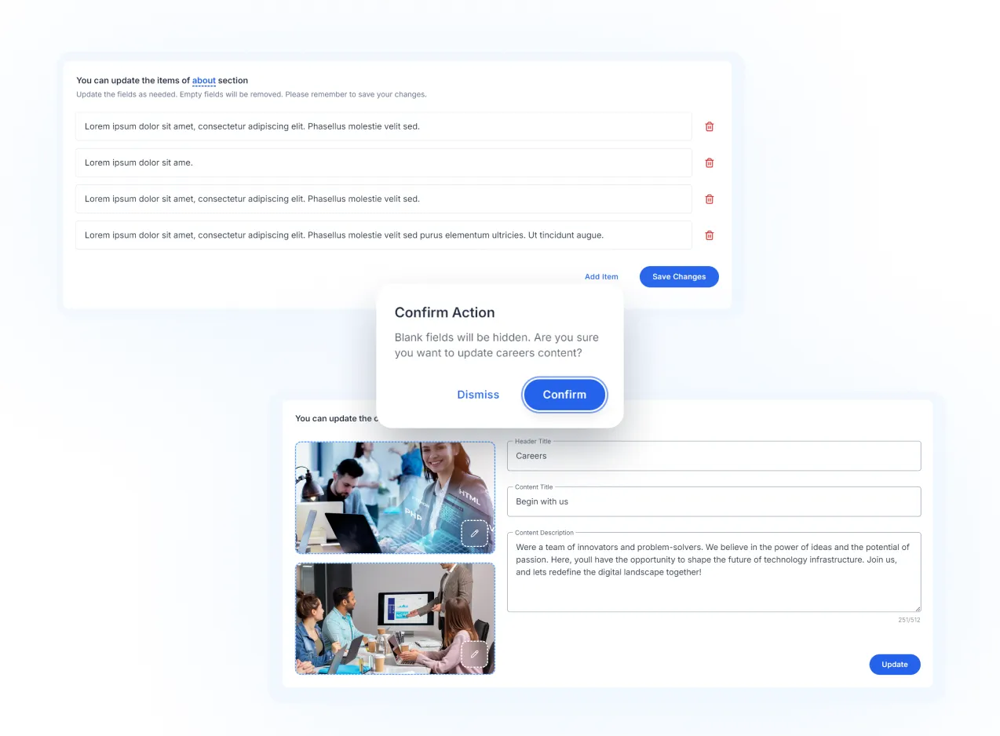
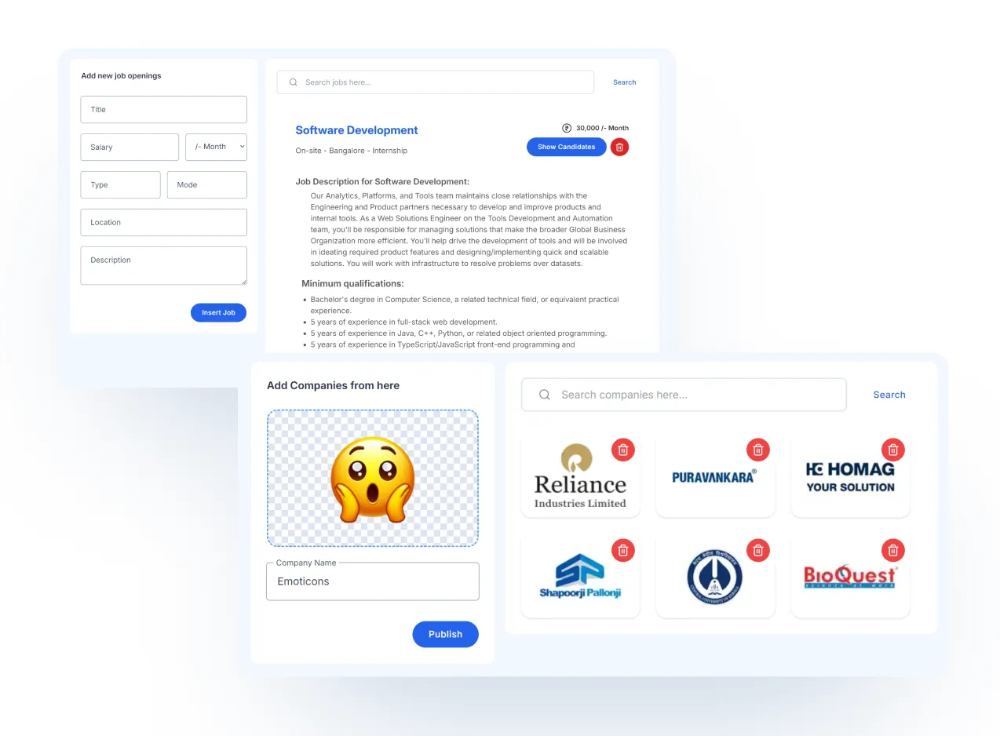
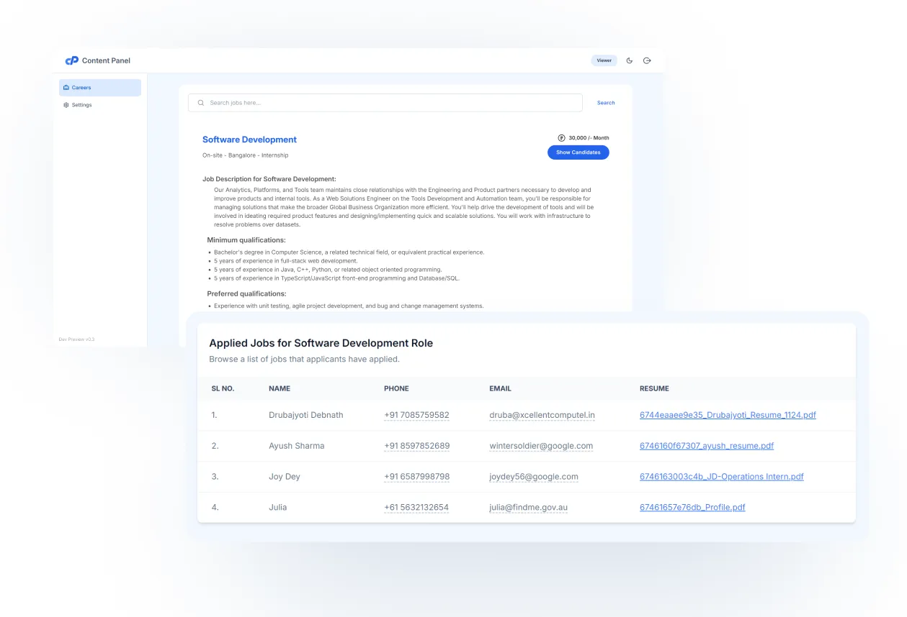

# Control Panel for Content Manipulation

The **Control Panel for Content Manipulation** is a web-based platform designed to manage the content of a website effectively through a simple Role-Based Access Control (RBAC) system. This system defines four distinct roles: **Admin**, **Content Manager**, **Manager**, and **Viewer**. Each role has specific access levels and permissions for content manipulation, ensuring that only authorized users can perform certain tasks.

> **Note:** This repository is a **UI-only** showcase, providing the front-end implementation of the control panel. The development deployment for preview can be accessed through the following link: [Deployment Preview](https://cms.xcellentcomputel.in)

## Role-Based Access Control (RBAC)
The system leverages RBAC to manage user permissions efficiently. By categorizing users into specific roles, it provides a clear structure for access control, allowing users to perform only those tasks relevant to their roles.

### Roles and Permissions

#### 1. **Admin**
- **Permissions**: The **Admin** has full access to all functionalities of the control panel. They can:
  - Manage users and their roles.
  - Edit, update, or delete any content on the website.
  - Add, remove, or change roles for any user.
  - Perform other administrative tasks as needed.
- **Responsibilities**: Admin is responsible for maintaining overall control and security of the platform. They ensure that all content is properly managed and that user permissions are correctly assigned.

#### 2. **Content Manager**
- **Permissions**: The **Content Manager** has more limited access compared to the Admin. They can:
  - Edit, update, or delete any content on the website.
  - Review and manage content uploaded by other users.
  - Access the content creation tools for editing various website sections.
- **Responsibilities**: Content Managers handle the day-to-day content updates on the site. They ensure that all text, images, and media are up to date and reflect the current website needs.

#### 3. **Manager**
- **Permissions**: The **Manager** role has access to:
  - Add or remove items such as contact pages, company information, etc.
  - View and modify certain sections of the site but do not have full control over content.
  - Manage some lower-level administrative tasks.
- **Responsibilities**: Managers oversee specific areas of the site like managing contact pages, companies, or other sections that do not require full content editing. They can modify structural elements of the website but cannot alter the actual content unless assigned.

#### 4. **Viewer**
- **Permissions**: The **Viewer** has read-only access to the platform. They can:
  - View job listings and the candidates who applied for those jobs.
  - View candidates' contact details and their resumes.
- **Responsibilities**: Viewers are typically stakeholders who need access to view content such as job postings, applications, and resumes but are not permitted to make any changes to the website or its content. Their role is primarily for observation.

## System Workflow
- **Authentication**: Users are authenticated before being assigned to a role. Once authenticated, the system determines which actions are permitted based on the user's assigned role.
- **Content Management**: Each role has different access rights to content management tools. Admins and Content Managers have the ability to edit, update, or delete content, while Managers can only add or remove structural elements, and Viewers can only access content.
- **User Role Assignment**: Admins can assign or change user roles, ensuring that only authorized users have access to the relevant functionalities.

## Technologies Used
- **Frontend**: HTML, TailwindCSS, JavaScript
- **Backend**: PHP
- **Database**: MySQL (PDO)

## How to use

### Step-by-Step Instructions

1. **Login Page**  
   First, access the login page where you can enter your credentials. [Live Demo](https://cms.xcellentcomputel.in/admin)

   
   > Username: test   Password: 1234
   
2. **User Control Panel**  
   After logging in, you can go to Settings to Create or Edit users and their roles.  

   

3. **Role Assignment**  
   Click on edit or add new user, to assign to one of the four roles. Each role has specific access permissions.  

   

3. **Navigating the Control Panel**  
   Once user created, he can navigate to the dashboard based on his role. Admins will have full access, while Content Managers will have a more restricted view.

   

4. **Managing Content (For Admin & Content Managers)**  
   Admins and Content Managers can edit, update, and delete website content from the content management section.  

   

5. **Adding or Removing Structural Items (For Managers)**  
   Managers can add or remove structural items like jobs, clients, etc. 

   

6. **Viewing Job Listings (For Viewers)**  
   Viewers can view all available job listings, candidate resumes, and contact details.

   
